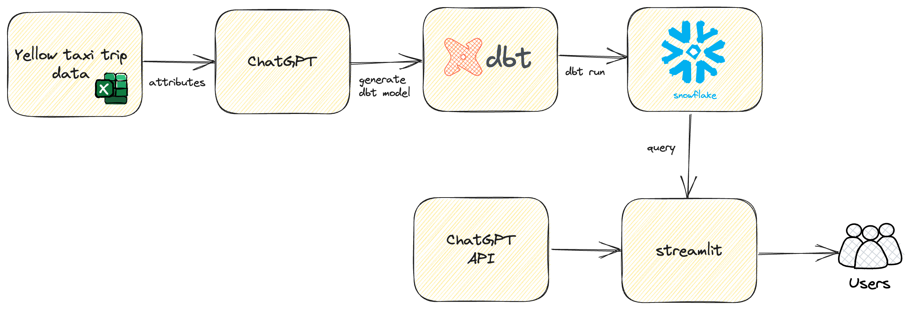

- [Overview](#overview)
- [Architecture](#architecture)
- [Data Warehouse Data Model](#data-warehouse-data-model)
    - [dim\_vendor](#dim_vendor)
    - [dim\_date](#dim_date)
    - [dim\_rate](#dim_rate)
    - [dim\_location](#dim_location)
    - [dim\_payment\_type](#dim_payment_type)
    - [fact\_trip](#fact_trip)
- [Instructions](#instructions)
- [Reference](#reference)
- [Known Issues and Solution](#known-issues-and-solution)
- [Future Enhancements](#future-enhancements)
  
# Overview
This repository contains code that demonstrates the use of ChatGPT to create and query data models in Snowflake.

# Architecture
Refer to the diagram below for a high-level architecture.

  

# Data Warehouse Data Model
The model below was generated using the [prompt](./prompts/01_generate_data_model.txt) in a ChatGPT chat session.

### dim_vendor
- vendor_id (PK)
- vendor_code
- vendor_name

### dim_date
- date_id (PK)
- date
- year
- month
- day
- day_name
- month_name
- day_of_week
- day_of_year
- is_weekend
- is_holiday

### dim_rate
- rate_id (PK)
- rate_code
- rate_name

### dim_location
- location_id (PK)
- longitude
- latitude

### dim_payment_type
- payment_type_id (PK)
- payment_type_code
- payment_type_name

### fact_trip
- trip_id (PK)
- vendor_id (FK)
- pickup_date_id (FK)
- dropoff_date_id (FK)
- pickup_location_id (FK)
- dropoff_location_id (FK)
- rate_id (FK)
- payment_type_id (FK)
- passenger_count
- trip_distance
- pickup_timestamp
- dropoff_timestamp
- fare_amount
- extra
- mta_tax
- tip_amount
- tolls_amount
- improvement_surcharge
- total_amount

# Instructions
Refer to [this blog](https://www.entechlog.com/blog/data/chat-with-data-in-snowflake-using-chatgpt-dbt-and-streamlit/) for more details.

# Reference 
- https://www.kaggle.com/datasets/elemento/nyc-yellow-taxi-trip-data?resource=download
- https://www.nyc.gov/assets/tlc/downloads/pdf/data_dictionary_trip_records_yellow.pdf
- https://github.com/darshilparmar/uber-etl-pipeline-data-engineering-project
- https://github.com/fivethirtyeight/data
- https://pythonspeed.com/articles/activate-conda-dockerfile/
- https://github.com/mydgd/snowflake-table-catalog/tree/main
- https://quickstarts.snowflake.com/guide/frosty_llm_chatbot_on_streamlit_snowflake/
  
# Known Issues and Solution

| Error                                                                                                                                                                                                                                                             | Solution                                                                                                              |
| ----------------------------------------------------------------------------------------------------------------------------------------------------------------------------------------------------------------------------------------------------------------- | --------------------------------------------------------------------------------------------------------------------- |
| When testing on a schema with a few hundred tables and columns, the following error occurred: InvalidRequestError: This model's maximum context length is 4097 tokens. However, your messages resulted in 22564 tokens. Please reduce the length of the messages. | You must use a different model which supports more tokens, or logically reduce the tokens before making the API call. |
| SnowparkSQLException: (1304): 390114 (08001): Authentication token has expired. The user must authenticate again. | |

# Future Enhancements

| Feature | Status |
| ------- | ------ |
