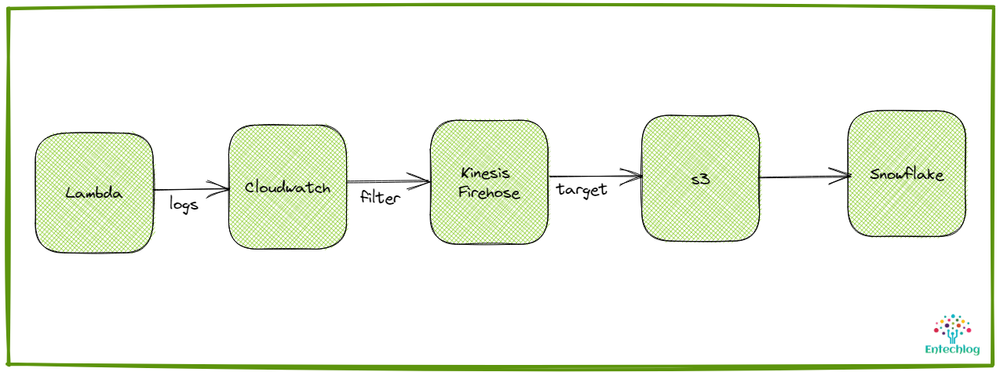

- [Overview](#overview)
- [Architecture](#architecture)
- [Instructions](#instructions)
  - [Blog](#blog)
  - [Terraform commands](#terraform-commands)
- [Reference](#reference)
- [Testing](#testing)
- [Validate results](#validate-results)
- [Future Enhancements](#future-enhancements)
  
# Overview
This repo contains code to ingest AWS Cloudwatch logs to Snowflake

# Architecture
See below diagram for high level architecture

<p align="center">
  
</p>

# Instructions
- cd into `terraform\aws`
- Create a copy of `terraform.tfvars.template` as `terraform.tfvar` and update the same with values for all required parameters. It's okay to not set `snowflake_api_aws_iam_user_arn` and `snowflake_api_aws_external_id` in the first run. This will be obtained from snowflake integration terraform output
- Create the resource by running following commands
  ```bash
  terraform init
  terraform plan
  terraform apply
  ```
- cd into `terraform\snowflake`
- Create a copy of `terraform.tfvars.template` as `terraform.tfvar` and update the same with values for all required parameters
- Create the resource by running following commands
  ```bash
  terraform init
  terraform plan
  terraform apply
  ```
- cd into `terraform\aws`
- Update `terraform.tfvar` to add `snowflake_storage_integration__storage_aws_iam_user_arn` and `snowflake_storage_integration__storage_aws_external_id` from the previous run
- Update the resource by running following commands
  ```bash
  terraform apply
  ```
- This should create and configure all resources in Snowflake and AWS required for external function

## Blog
See this blog for more details

## Terraform commands

```bash
# install custom modules
terraform init

# format code
terraform fmt -recursive

# plan to review the summary of changes
terraform plan

# apply the changes to target environment
terraform apply
terraform apply --auto-approve

# delete all resources from target, DO NOT do this in any environment unless its really needed 🔥
terraform destroy
terraform destroy --auto-approve

# Generate token by running
terraform login

# Migrate local state to backend
terraform init

# Remove local state after copying to backend
rm terraform.tfstate

# To upgrade provider version
terraform init -upgrade

# List Terrafrom state
terraform state list

# Remove all states, DO NOT do this in any environment unless its really needed 🔥
for i in $(terraform state list); do terraform state rm $i; done
```

# Reference 
- https://docs.snowflake.com/en/user-guide/data-load-s3-config-storage-integration
- https://registry.terraform.io/providers/hashicorp/aws/latest/docs/resources/kinesis_firehose_delivery_stream


# Testing


# Validate results

```sql
USE DATABASE <database-name>;
USE SCHEMA <schema-name>;

SHOW STAGES;
DESC STAGE <stage-name>;
LIST @<stage-name>;

SELECT src.metadata$filename AS file_name,
	src.metadata$file_row_number AS file_row_number,
	src.metadata$file_content_key AS file_content_key,
	src.metadata$file_last_modified AS file_last_modified,
	src.metadata$start_scan_time,
	src.$1 AS cloudwatch_log
FROM @<stage-name> src;
```

# Future Enhancements

| Feature | Status |
| ------- | ------ |