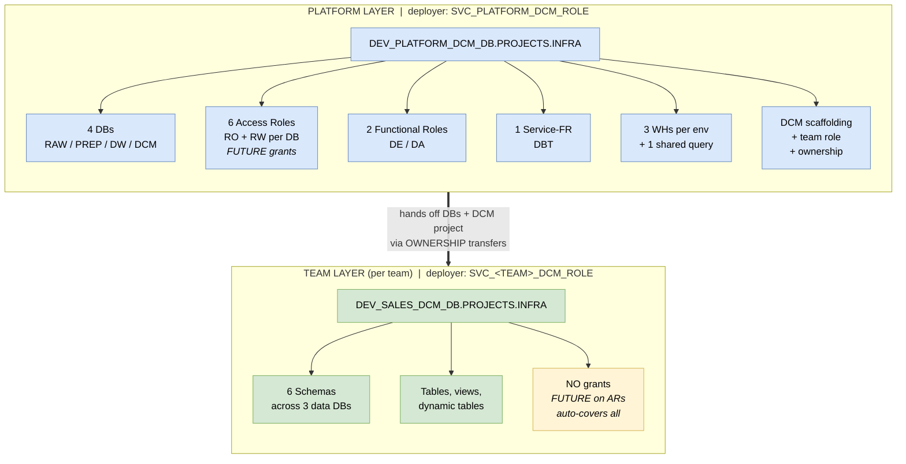
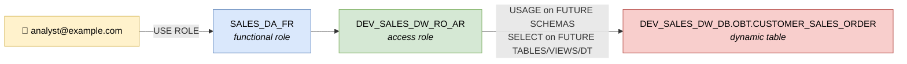

# Snowflake DCM Projects - Reference Demo

End-to-end Database Change Management example for Snowflake using **DCM Projects**, structured as the **hybrid platform + team pattern** with a full **AR / FR / SVC_FR** role layering. Manages databases, schemas, tables, views, dynamic tables, warehouses, roles, and grants declaratively from a single source of truth.

Swap `team_name` in `platform/dcm/manifest.yml` `teams:` list (and add a matching `teams/<name>/` directory) to model your own domains.

## Architecture (hybrid pattern)

Two DCM projects per team - **platform** (foundation) + **team** (data) - each with its own deployer role. Platform owns the perimeter (DBs, roles, warehouses), team owns what's inside (schemas, tables, views).



The role chain in action - analyst reads a table via FR → AR → FUTURE grant, with zero direct grants on the object:



## Naming conventions

Env-first prefix preserved per repo standard (groups all DEV things together for Snowsight browsing). See `shared/macros/env_helpers.sql` for the canonical builders.

| Object | Pattern | Example |
|---|---|---|
| Database | `{ENV}_{PROJ}_{LAYER}_DB` | `DEV_SALES_DW_DB` |
| Warehouse (per env) | `{ENV}_{PROJ}_{TOOL}_WH_{SIZE}` | `DEV_SALES_DBT_WH_XS` |
| Warehouse (shared) | `ALL_{PROJ}_{TOOL}_WH_{SIZE}` | `ALL_SALES_QUERY_WH_XS` |
| **Access Role** (per DB, env-scoped) | `{ENV}_{PROJ}_{LAYER}_{ACCESS}_AR` | `DEV_SALES_RAW_RO_AR`, `DEV_SALES_DW_RW_AR` |
| **Functional Role** (no env, per job) | `{PROJ}_{ROLE}_FR` | `SALES_DE_FR`, `SALES_DA_FR` |
| **Service-FR** (per env, per tool) | `{ENV}_{PROJ}_{TOOL}_SVC_FR` | `DEV_SALES_DBT_SVC_FR` |
| Team DCM deployer role | `SVC_{PROJ}_DCM_ROLE` | `SVC_SALES_DCM_ROLE` |
| Team DCM deployer user | `SVC_{PROJ}_DCM_USER` | `SVC_SALES_DCM_USER` |
| DCM project (platform) | `{ENV}_PLATFORM_DCM_DB.PROJECTS.INFRA` | `DEV_PLATFORM_DCM_DB.PROJECTS.INFRA` |
| DCM project (team) | `{ENV}_{PROJ}_DCM_DB.PROJECTS.INFRA` | `DEV_SALES_DCM_DB.PROJECTS.INFRA` |

## Role architecture (AR / FR / SVC_FR)

The role layer separates *what privileges exist* (AR) from *who's the user* (FR / SVC_FR). Each layer changes for one reason: new DB → new ARs; new tool → new SVC_FR; new analyst → grant the FR. The flow diagram in [Architecture](#architecture-hybrid-pattern) shows the chain visually.

**Anti-patterns** (enforced by this demo's structure):
- Never grant an AR directly to a user - always go user → FR → AR
- Never grant FR to another FR - compose FRs from ARs only
- Never put `MANAGE GRANTS` on a team role - the platform role holds it and issues `FUTURE` grants on the ARs; team role just creates objects and FUTURE coverage applies

**Why FUTURE grants work without team-level MANAGE GRANTS:** the platform role (which legitimately has `MANAGE GRANTS`) creates the ARs and issues `GRANT … ON FUTURE TABLES IN DATABASE` while it still owns the DB. Ownership then transfers to the team. FUTURE grants survive ownership transfer, so any table the team creates afterwards inherits the AR's privileges automatically. The team role never touches grants - it just runs DDL.

## Data layer chain

```
RAW_DB           PREP_DB           DW_DB                    DCM_DB
└── SEED   ───►  ├── DIM    ───►   ├── DIM                  └── PROJECTS
                 └── FACT          ├── FACT                      └── INFRA  ◄── DCM PROJECT
                                   └── OBT ◄── dynamic table
```

PREP mirrors DW's `DIM` / `FACT` shape — PREP is the conformed staging form, DW is the consumer-facing final form. DCM_DB holds the DCM project object (state) and nothing else.

## Macros — single source of truth via `shared/`

DCM requires macros to live INSIDE each project's `sources/macros/` directory. With multiple projects (platform + per-team), keeping N copies in git would let them drift. So:

- **Canonical copy** (only thing tracked in git): `snow-infra/dcm/shared/macros/env_helpers.sql`
- **Per-project copies** (gitignored): `platform/dcm/sources/macros/` and `teams/<team>/dcm/sources/macros/` — populated at run time by `scripts/sync_macros.sh`

The `.gitignore` excludes `snow-infra/dcm/platform/dcm/sources/macros/*.sql` and `snow-infra/dcm/teams/*/dcm/sources/macros/*.sql` so the sync output is never committed.

**After clone — one-time sync:**
```bash
snow-infra/dcm/scripts/sync_macros.sh
```

**Workflow:**
- Edit `shared/macros/env_helpers.sql` only
- The local plan/deploy scripts (`platform/scripts/0[12]_*.sh`, `teams/<team>/scripts/0[12]_*.sh`) call `sync_macros.sh` automatically before every `snow dcm` invocation, so you can't forget
- CI also runs it before every plan/deploy as a safety net (`.github/workflows/dcm-deploy.yml`)

If you run `snow dcm` directly (not via the wrappers), run the sync first.

The macros are parameterized (every name builder takes `team` as the first argument), so the single canonical file works for both platform (loops over teams) and team layers (passes its own `team_name` from manifest defaults).

## Runtime env vars

Both manifests reference `{{ env.SNOWFLAKE_ACCOUNT }}` and `{{ env.SNOWFLAKE_ROLE }}` in target fields. DCM substitutes these at plan/deploy time from the shell environment, so the manifests are committed without any account or role hardcoded.

**Local dev:** values live in `snow-tools/.env` and are loaded into the container automatically by docker-compose:

| Var | Purpose | Default |
|---|---|---|
| `SNOWFLAKE_HOME` | Snow CLI config dir (host-mounted, persistent) | e.g. `/C/Users/<you>/.snowflake` on Windows |
| `SNOWFLAKE_ACCOUNT` | manifest `account_identifier` | your `ORG-ACCOUNT` |
| `SNOWFLAKE_ROLE` | manifest `project_owner` | `SVC_PLATFORM_DCM_ROLE` |

Edit `snow-tools/.env` once, then `docker-compose down && docker-compose up -d` to apply. Override `SNOWFLAKE_ROLE` inline (`export SNOWFLAKE_ROLE=SVC_SALES_DCM_ROLE`) when switching to team plan/deploy.

**CI:** GitHub Actions sets the same vars from secrets per job (see `.github/workflows/dcm-deploy.yml`).

## Prerequisites

- Snowflake account with **ACCOUNTADMIN access** (one-time bootstrap only)
- The `snow-tools` container from this repo with `.env` configured (see above):
  ```bash
  cd ../../snow-tools
  cp .env.template .env       # first time only — then edit the values
  docker-compose up -d --build
  ```

## Getting started

> All shell commands run inside the `snow-tools` container:
> ```bash
> docker exec -it snow-tools bash
> cd <path-to-this-repo>/snow-infra/dcm     # one time per shell — all later commands are relative
> ```
> Replace `<path-to-this-repo>` with wherever you cloned the repo on the host (visible inside the container via the `/C` bind mount on Windows or the equivalent on macOS/Linux).

### Step 1 - Platform bootstrap (Snowsight, ACCOUNTADMIN)

Paste `platform/bootstrap/01_create_platform_service_role.sql` into Snowsight as ACCOUNTADMIN. It creates:
- `SVC_PLATFORM_DCM_ROLE` with the full account-level privilege set (CREATE DB/WH/ROLE/USER + MANAGE GRANTS + DATA_QUALITY app roles)
- `SVC_PLATFORM_DCM_USER` (TYPE = SERVICE, key-pair only)
- `SVC_PLATFORM_DCM_WH_XS`
- Prints your `ORG-ACCOUNT` identifier - save it

### Step 2 - Generate the platform RSA key (in snow-tools)

```bash
./platform/bootstrap/00_generate_platform_rsa_key.sh
```

Keys land at `$SNOWFLAKE_HOME/keys/svc_platform_dcm.{p8,pub}` (host-mounted path from `.env`). Copy the printed `ALTER USER … SET RSA_PUBLIC_KEY = '…'` into Snowsight and run.

### Step 3 - Create the platform DCM project objects

Either paste `platform/bootstrap/02_create_platform_project_objects.sql` into Snowsight, or run it via snow CLI after Step 6:
```bash
snow sql --connection dcm-platform-dev -f platform/bootstrap/02_create_platform_project_objects.sql
```

### Step 4 - Create the SALES team's DCM USER (one-time, ACCOUNTADMIN)

This is the team's headless deployer. The role for it (`SVC_SALES_DCM_ROLE`) is created BY the platform DCM project in Step 6 - but the USER must exist beforehand because its RSA key needs to be registered out-of-band.

In Snowsight, as ACCOUNTADMIN:
```sql
USE ROLE SECURITYADMIN;
CREATE USER IF NOT EXISTS SVC_SALES_DCM_USER
  TYPE              = SERVICE
  DEFAULT_WAREHOUSE = SVC_PLATFORM_DCM_WH_XS
  COMMENT           = 'Service account for SALES team DCM plan/deploy';
```

### Step 5 - Generate the SALES team RSA key (in snow-tools)

```bash
./teams/sales/bootstrap/00_generate_rsa_key.sh
```

Paste the printed `ALTER USER SVC_SALES_DCM_USER SET RSA_PUBLIC_KEY = '…'` into Snowsight and run.

### Step 6 - Wire up Snow CLI

1. From the host, copy `config.toml.template` to `$SNOWFLAKE_HOME/config.toml` (the path you set in `snow-tools/.env`) and edit `account` in all 6 connection blocks to your `ORG-ACCOUNT`.
2. Set the same `ORG-ACCOUNT` in `snow-tools/.env` as `SNOWFLAKE_ACCOUNT`, then from the host restart the container so the env vars load:
   ```bash
   cd snow-tools && docker-compose down && docker-compose up -d
   ```
3. Test (in the container shell):
   ```bash
   snow connection test --connection dcm-platform-dev
   # Status: OK
   ```

### Step 7 - Platform plan + deploy

```bash
./scripts/sync_macros.sh                              # one-time per shell after fresh clone
./platform/scripts/01_plan.sh DEV                     # review out/plan.json
./platform/scripts/02_deploy.sh DEV "initial-platform"
```

After deploy: 4 DBs (RAW/PREP/DW/DCM), 6 ARs, 2 FRs, 1 SVC_FR, 2 WHs (DBT + ALL_QUERY), the SALES DCM role, all ownership transfers, the SALES user attachment.

### Step 8 - Create the SALES team DCM PROJECT object

DCM can't declare a DCM PROJECT inside another DCM project. Create the team project once out-of-band (snow-tools shell from Step 7):

```bash
export SNOWFLAKE_ROLE=SVC_SALES_DCM_ROLE     # switch to team deployer
snow sql --connection dcm-sales-dev -q "
    USE ROLE SVC_SALES_DCM_ROLE;
    USE WAREHOUSE SVC_PLATFORM_DCM_WH_XS;
    CREATE SCHEMA IF NOT EXISTS DEV_SALES_DCM_DB.PROJECTS;
    CREATE DCM PROJECT IF NOT EXISTS DEV_SALES_DCM_DB.PROJECTS.INFRA;
"
```

### Step 9 - SALES team plan + deploy

```bash
./teams/sales/scripts/01_plan.sh DCM_SALES_DEV         # review out/plan.json
./teams/sales/scripts/02_deploy.sh DCM_SALES_DEV "initial-team"
```

Deploy auto-runs `post_scripts/01_seed_data.sql` (TRUNCATE + INSERT seed rows + REFRESH dynamic tables).

### Step 10 - Verify

```sql
USE ROLE SALES_DA_FR;
USE WAREHOUSE ALL_SALES_QUERY_WH_XS;
SELECT * FROM DEV_SALES_DW_DB.OBT.CUSTOMER_SALES_ORDER;
```

Rows means the chain works: FR → AR (FUTURE) → object, no direct grants.

## Adding a new team

This is the test of whether the pattern actually scales. To onboard `MARKETING`:

1. **Platform manifest**: add `{ name: MARKETING }` to the `teams:` list in `platform/dcm/manifest.yml`
2. **Create the team's DCM USER** in Snowsight (ACCOUNTADMIN): `CREATE USER SVC_MARKETING_DCM_USER TYPE=SERVICE …`
3. **Generate the team RSA key**: `SF_USER=SVC_MARKETING_DCM_USER KEY_NAME=svc_marketing_dcm ./teams/sales/bootstrap/00_generate_rsa_key.sh` (or copy that script under `teams/marketing/bootstrap/`)
4. **Register the public key** in Snowsight (ACCOUNTADMIN)
5. **Platform deploy** - creates MARKETING DBs, ARs, FRs, SVC_FRs, warehouses, DCM scaffolding
6. **Create MARKETING DCM schema + project** out-of-band as the team role: `CREATE SCHEMA DEV_MARKETING_DCM_DB.PROJECTS; CREATE DCM PROJECT DEV_MARKETING_DCM_DB.PROJECTS.INFRA;`
7. **Copy** `teams/sales/` → `teams/marketing/`, swap `team_name: MARKETING` in manifest, push
8. **Team deploy** - creates schemas, tables, etc. inside the MARKETING DBs

The marketing team can now plan/deploy independently of SALES. Both teams' projects live in their own DBs; neither can see the other's plan history.

## Templating model

| Variable | Where | Drives |
|---|---|---|
| `proj_code` / `team_name` | platform manifest `teams:` list / team manifest defaults | Object name infix |
| `env_code` | per-target config | Env prefix on env-scoped objects |
| `deploy_account_user_roles` | true only in PLATFORM_DEV target | Account-level FRs + team DCM role created once |
| `data_retention_days` | per-target | Snowflake Time Travel retention |
| `*_wh_size`, `auto_suspend_seconds` | per-target | Per-env warehouse sizing |

DCM forbids `` / `` / `` - macros under `sources/macros/` are auto-loaded globally per project. Call by bare name.

## How DCM handles existing objects

DCM is fully declarative. First deploy → CREATEs. No code change → empty plan. Add a column → single ALTER. Manual drift → plan offers to reconcile.

## CI/CD

`.github/workflows/dcm-deploy.yml` uses the official `Snowflake-Labs/snowflake_dcm_projects/actions/` actions:

| Trigger | Action | Target |
|---|---|---|
| PR touching `snow-infra/dcm/**` | `dcm-plan` - posts plan as PR comment | DEV |
| Push to `develop` | plan + deploy | DEV |
| Push to `main` | plan + deploy → STG, then PRD (gated by `snowflake-prd` GitHub environment) | STG → PRD |
| `workflow_dispatch` (manual) | plan or deploy — pick target + action in the UI | any |

Built-in safety:
- `allow-drops: "false"` - deploy fails if plan contains DROP
- `comment-on-pr: "true"` - plan diff visible inline
- `post-scripts-path: "post_scripts"` - `01_seed_data.sql` auto-runs after deploy
- `test-expectations: "true"` - runs DCM expectations, fails on regressions

**End-to-end automation (zero manual Step 8):** every deploy job runs a pre-step (`.github/actions/ensure-team-dcm-project`) that idempotently issues `CREATE SCHEMA IF NOT EXISTS …` + `CREATE DCM PROJECT IF NOT EXISTS …` before `dcm-deploy`. So on a new team or new env, you don't need to bootstrap the DCM PROJECT manually — first deploy creates it, every subsequent one is a no-op.

**Required GitHub secrets per environment** (`snowflake-dev`, `snowflake-stg`, `snowflake-prd`):
- `SNOWFLAKE_ACCOUNT` — your `ORG-ACCOUNT` (e.g. `MYORG-MYACCOUNT`)
- `SNOWFLAKE_USER` — `SVC_SALES_DCM_USER`
- `SNOWFLAKE_PRIVATE_KEY` — raw PKCS8 PEM of `svc_sales_dcm.p8` (entire file content, BEGIN/END lines included)

### Testing the CI from a feature branch

To exercise the workflow on a non-`develop` / non-`main` branch (e.g. `feature/<name>`):

1. **PR plan** — open a PR from your feature branch. The `plan` job runs and posts the diff as a PR comment. No deploy.
2. **Manual deploy to any env** — `Actions` tab → *DCM Plan & Deploy* → *Run workflow* → select your feature branch + a `target` (DCM_SALES_DEV / STG / PRD) + `action = deploy`. The `manual-deploy` job:
   - Picks the matching GitHub Environment automatically (`snowflake-dev` / `snowflake-stg` / `snowflake-prd`)
   - Runs plan first, then the idempotent DCM-PROJECT pre-step, then deploy
   - For PRD the environment's approval gate still applies
3. **Promotion to develop / main** — once you're confident, merge feature → `develop` (auto DEV deploy), then `develop` → `main` (auto STG → PRD).

> **TST env?** The demo ships only DEV/STG/PRD. To add a TST env, mirror any one target block in `platform/dcm/manifest.yml` + `teams/sales/dcm/manifest.yml`, add `DCM_SALES_TST` to the `workflow_dispatch` target choices, and create a `snowflake-tst` GitHub Environment with the three secrets.

**ADO migration:** see header comments in `dcm-deploy.yml` for the field-by-field mapping.

> **Note:** the workflow currently only wires the SALES team layer. Mirror the same job structure for the platform layer if you want CI to drive both.

## Cleanup

Three options depending on what you want to keep.

**1. DCM-aware purge** (preferred — keeps DCM PROJECT objects, deploy history intact):
```bash
snow sql -f teams/sales/scripts/04_purge.sql --connection dcm-sales-dev
snow sql -f platform/scripts/04_purge.sql   --connection dcm-platform-dev
```

**2. Fresh-test wipe** (drops *all* demo objects in Snowflake — DBs, roles, WHs — but keeps Phase 0 bootstrap intact: `SVC_PLATFORM_DCM_USER`, `SVC_SALES_DCM_USER`, `SVC_PLATFORM_DCM_WH_XS`, registered RSA keys). Run in Snowsight as `ACCOUNTADMIN`:
```
snow-infra/dcm/platform/bootstrap/98_cleanup_for_fresh_test.sql
```
After this, redo from **Step 3** of [Getting started](#getting-started) (DCM project objects need to be recreated; bootstrap identities + keys stay).

**3. Full teardown** (also drops the platform service identity):
```
snow-infra/dcm/platform/bootstrap/99_teardown.sql
```

## References

- [DCM Projects overview](https://docs.snowflake.com/en/user-guide/dcm-projects/dcm-projects-overview)
- [DCM Projects files & templates](https://docs.snowflake.com/en/user-guide/dcm-projects/dcm-projects-files)
- [Snowflake-Labs/snowflake-dcm-projects](https://github.com/Snowflake-Labs/snowflake-dcm-projects) - canonical examples + GitHub Actions
- [Snowflake RBAC best practices (select.dev)](https://select.dev/posts/snowflake-rbac-best-practices) - AR/FR/SR pattern source
- [Snowflake object naming conventions (entechlog blog)](https://www.entechlog.com/blog/data/snowflake-object-naming-conventions/) - companion blog post
