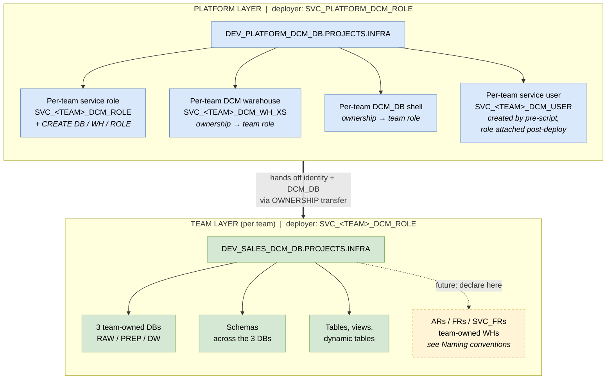

# Snowflake DCM Projects - Reference Demo

End-to-end Database Change Management example for Snowflake using **DCM Projects**, structured as a **platform-thin + team-self-service pattern** designed to scale to 10s–100s of data teams. Platform crosses each team's perimeter exactly once (creates the team's identity + bootstrap DCM_DB, then hands off); every team owns and declares everything inside its perimeter.

Swap `team_name` in `platform/dcm/manifest.yml` `teams:` list (and add a matching `teams/<name>/` directory) to model your own domains.

## Architecture (platform-thin + team-self-service)

Two DCM projects per team. **Platform** runs rarely (only when onboarding new teams or changing org-wide scaffolding). **Team** runs on every team change.



After Day-0 onboarding, the platform layer never touches the team again. Team's DCM role can `CREATE DATABASE` / `CREATE ROLE` / `CREATE WAREHOUSE` on the account — but **not** `MANAGE GRANTS`, because team OWNS the objects it creates and owner-grants (including FUTURE grants on owned DBs) work without MANAGE GRANTS.

## Naming conventions

Env-first prefix groups all DEV things together for Snowsight browsing. The demo only ships the macros it uses (`db_name`, `team_dcm_role`, `team_dcm_user`); the rest of the standard is just documented here so teams declare their own RBAC and warehouses using the same shape.

| Object | Pattern | Example | Who owns it |
|---|---|---|---|
| Database | `{ENV}_{TEAM}_{LAYER}_DB` | `DEV_SALES_DW_DB` | team (`DCM` layer = platform-bootstrapped) |
| Warehouse (per env) | `{ENV}_{TEAM}_{TOOL}_WH_{SIZE}` | `DEV_SALES_DBT_WH_XS` | team |
| Warehouse (shared) | `ALL_{TEAM}_{TOOL}_WH_{SIZE}` | `ALL_SALES_QUERY_WH_XS` | team |
| Access Role (per DB, env-scoped) | `{ENV}_{TEAM}_{LAYER}_{ACCESS}_AR` | `DEV_SALES_DW_RO_AR` | team |
| Functional Role (no env, per job) | `{TEAM}_{ROLE}_FR` | `SALES_DA_FR` | team |
| Service-FR (per env, per tool) | `{ENV}_{TEAM}_{TOOL}_SVC_FR` | `DEV_SALES_DBT_SVC_FR` | team |
| Team DCM deployer role | `SVC_{TEAM}_DCM_ROLE` | `SVC_SALES_DCM_ROLE` | platform |
| Team DCM deployer user | `SVC_{TEAM}_DCM_USER` | `SVC_SALES_DCM_USER` | platform (created out-of-band, role granted via DCM) |
| DCM project (platform) | `{ENV}_PLATFORM_DCM_DB.PROJECTS.INFRA` | `DEV_PLATFORM_DCM_DB.PROJECTS.INFRA` | platform |
| DCM project (team) | `{ENV}_{TEAM}_DCM_DB.PROJECTS.INFRA` | `DEV_SALES_DCM_DB.PROJECTS.INFRA` | platform-bootstrapped, team-owned |

## Optional RBAC layer (out of demo scope, documented for completeness)

The full Snowflake RBAC pattern that scales (Snowflake-recommended) is **AR / FR / SVC_FR**:

- **Access Role (`_AR`)** — per DB, env-scoped, holds the actual privileges via FUTURE grants
- **Functional Role (`_FR`)** — per job function (DA, DE, CORTEX, PIPE_ADMIN…), spans envs, granted to humans, composes ARs
- **Service-Functional Role (`_SVC_FR`)** — per tool + env (DBT, KAFKA, SUPERSET…), granted to service users, composes ARs

Anti-patterns:
- Never grant an AR directly to a user — always user → FR → AR
- Never grant FR to another FR — compose FRs from ARs only
- Never grant `MANAGE GRANTS` to a team role — team owns its DBs, so owner-grants are sufficient

This demo intentionally doesn't deploy this layer because it isn't required to show DCM mechanics. Teams adopting the demo declare their own AR/FR/SVC_FR in their team DCM project, following the patterns in the naming table above.

## Data layer chain

```
RAW_DB           PREP_DB           DW_DB                    DCM_DB
└── SEED   ───►  ├── DIM    ───►   ├── DIM                  └── PROJECTS
                 └── FACT          ├── FACT                      └── INFRA  ◄── DCM PROJECT
                                   └── OBT ◄── dynamic table
```

PREP mirrors DW's `DIM` / `FACT` shape — PREP is the conformed staging form, DW is the consumer-facing final form. DCM_DB holds the DCM project object (state) and nothing else.

## Macros — single source of truth via `shared/`

DCM requires macros to live INSIDE each project's `sources/macros/` directory. With multiple projects (platform + per-team), keeping N copies in git would let them drift. So:

- **Canonical copy** (only thing tracked in git): `snow-infra/dcm/shared/macros/env_helpers.sql`
- **Per-project copies** (gitignored): `platform/dcm/sources/macros/` and `teams/<team>/dcm/sources/macros/` — populated at run time by `scripts/sync_macros.sh`

The `.gitignore` excludes `snow-infra/dcm/platform/dcm/sources/macros/*.sql` and `snow-infra/dcm/teams/*/dcm/sources/macros/*.sql` so the sync output is never committed.

**After clone — one-time sync:**
```bash
snow-infra/dcm/scripts/sync_macros.sh
```

**Workflow:**
- Edit `shared/macros/env_helpers.sql` only
- The local plan/deploy scripts (`platform/scripts/0[12]_*.sh`, `teams/<team>/scripts/0[12]_*.sh`) call `sync_macros.sh` automatically before every `snow dcm` invocation, so you can't forget
- CI also runs it before every plan/deploy as a safety net (`.github/workflows/dcm-deploy.yml`)

If you run `snow dcm` directly (not via the wrappers), run the sync first.

The macros are parameterized (every name builder takes `team` as the first argument), so the single canonical file works for both platform (loops over teams) and team layers (passes its own `team_name` from manifest defaults).

## Runtime env vars

Both manifests reference `{{ env.SNOWFLAKE_ACCOUNT }}` and `{{ env.SNOWFLAKE_ROLE }}` in target fields. DCM substitutes these at plan/deploy time from the shell environment, so the manifests are committed without any account or role hardcoded.

**Local dev:** values live in `snow-tools/.env` and are loaded into the container automatically by docker-compose:

| Var | Purpose | Default |
|---|---|---|
| `SNOWFLAKE_HOME` | Snow CLI config dir (host-mounted, persistent) | e.g. `/C/Users/<you>/.snowflake` on Windows |
| `SNOWFLAKE_ACCOUNT` | manifest `account_identifier` | your `ORG-ACCOUNT` |
| `SNOWFLAKE_ROLE` | manifest `project_owner` | `SVC_PLATFORM_DCM_ROLE` |

Edit `snow-tools/.env` once, then `docker-compose down && docker-compose up -d` to apply. Override `SNOWFLAKE_ROLE` inline (`export SNOWFLAKE_ROLE=SVC_SALES_DCM_ROLE`) when switching to team plan/deploy.

**CI:** GitHub Actions sets the same vars from secrets per job (see `.github/workflows/dcm-deploy.yml`).

## Prerequisites

- Snowflake account with **ACCOUNTADMIN access** (one-time bootstrap only)
- The `snow-tools` container from this repo with `.env` configured (see above):
  ```bash
  cd ../../snow-tools
  cp .env.template .env       # first time only — then edit the values
  docker-compose up -d --build
  ```

## Getting started

> All shell commands run inside the `snow-tools` container:
> ```bash
> docker exec -it snow-tools bash
> cd <path-to-this-repo>/snow-infra/dcm     # one time per shell — all later commands are relative
> ```
> Replace `<path-to-this-repo>` with wherever you cloned the repo on the host (visible inside the container via the `/C` bind mount on Windows or the equivalent on macOS/Linux).

### Step 1 - Platform bootstrap (Snowsight, ACCOUNTADMIN)

Paste `platform/bootstrap/01_create_platform_service_role.sql` into Snowsight as ACCOUNTADMIN. It creates:
- `SVC_PLATFORM_DCM_ROLE` with account-level privileges: `CREATE DATABASE/WAREHOUSE/ROLE/USER` (all **WITH GRANT OPTION** so the role can re-grant them to per-team roles), `MANAGE GRANTS`, plus a few utility grants (`EXECUTE TASK`, `APPLY MASKING POLICY`, etc.) and DATA_QUALITY app roles
- `SVC_PLATFORM_DCM_USER` (`TYPE = SERVICE`, key-pair only)
- `SVC_PLATFORM_DCM_WH_XS`
- Prints your `ORG-ACCOUNT` identifier — save it

### Step 2 - Generate the platform RSA key (in snow-tools)

```bash
./platform/bootstrap/00_generate_platform_rsa_key.sh
```

Keys land at `$SNOWFLAKE_HOME/keys/svc_platform_dcm.{p8,pub}` (host-mounted path from `.env`). Copy the printed `ALTER USER … SET RSA_PUBLIC_KEY = '…'` into Snowsight as `ACCOUNTADMIN` and run. (Snow CLI isn't wired yet, so this one registration is irreducibly a Snowsight paste — every later key registration uses `--register-via` instead.)

### Step 3 - Wire up Snow CLI

1. From the host, copy `config.toml.template` to `$SNOWFLAKE_HOME/config.toml` (the path you set in `snow-tools/.env`) and edit `account` in all 6 connection blocks to your `ORG-ACCOUNT`.
2. Set the same `ORG-ACCOUNT` in `snow-tools/.env` as `SNOWFLAKE_ACCOUNT`, then from the host restart the container so the env vars load:
   ```bash
   cd snow-tools && docker-compose down && docker-compose up -d
   ```
3. Test (in the container shell):
   ```bash
   snow connection test --connection dcm-platform-dev
   # Status: OK
   ```
   If this errors with `JWT token is invalid`, see [Troubleshooting](#troubleshooting).

### Step 4 - Create the platform DCM project objects

```bash
snow sql --connection dcm-platform-dev -f platform/bootstrap/02_create_platform_project_objects.sql
```

Creates `{ENV}_PLATFORM_DCM_DB.PROJECTS.INFRA` for each of DEV / STG / PRD.

### Step 5 - Platform plan + deploy

The deploy script pre-creates each team's service USER (via `_ensure_team_users.sh`) since DCM doesn't support USER as a declarable entity. Everything else (role, scoped account privileges, team DCM warehouse, team DCM_DB shell, ownership transfers, role-to-user grant) is declarative DCM.

```bash
./scripts/sync_macros.sh                              # one-time per shell after fresh clone
./platform/scripts/01_plan.sh DEV                     # review out/plan.json
./platform/scripts/02_deploy.sh DEV "initial-platform"
```

After deploy: `SVC_SALES_DCM_USER`, `SVC_SALES_DCM_ROLE` (with `CREATE DATABASE` / `CREATE ROLE` / `CREATE WAREHOUSE`), `SVC_SALES_DCM_WH_XS` (owned by team role), `DEV_SALES_DCM_DB` shell (owned by team role), role-to-user grant. The team is now self-sufficient.

### Step 6 - Generate + register the SALES team RSA key

One bash command — generates the key on disk AND registers the public key against `SVC_SALES_DCM_USER` via snow CLI (no Snowsight paste):

```bash
./teams/sales/bootstrap/00_generate_rsa_key.sh --register-via dcm-platform-dev
```

The platform role owns the team user (it created it in Step 5), so it can `ALTER USER … SET RSA_PUBLIC_KEY` without `MANAGE GRANTS`. Verify:
```bash
snow sql --connection dcm-platform-dev -q "DESC USER SVC_SALES_DCM_USER;" | grep RSA_PUBLIC_KEY_FP
```

Then test the team connection:
```bash
snow connection test --connection dcm-sales-dev
# Status: OK
```

### Step 7 - Create the SALES team DCM PROJECT object

DCM can't declare a DCM PROJECT inside another DCM project. Create it once per env, scripted:

```bash
snow sql --connection dcm-sales-dev -q "
  USE ROLE SVC_SALES_DCM_ROLE;
  USE WAREHOUSE SVC_SALES_DCM_WH_XS;
  CREATE SCHEMA IF NOT EXISTS DEV_SALES_DCM_DB.PROJECTS;
  CREATE DCM PROJECT IF NOT EXISTS DEV_SALES_DCM_DB.PROJECTS.INFRA;
"
```

CI does this automatically via the `ensure-team-dcm-project` composite action on every deploy — idempotent so re-runs are safe.

### Step 8 - SALES team plan + deploy

```bash
./teams/sales/scripts/01_plan.sh DCM_SALES_DEV         # review out/plan.json
./teams/sales/scripts/02_deploy.sh DCM_SALES_DEV "initial-team"
```

This creates 16 entities: 3 DBs (RAW/PREP/DW), 6 schemas, 4 tables, 2 views, 1 dynamic table.

### Step 9 - Seed data

The local `02_deploy.sh` doesn't run post-scripts (CI's `dcm-deploy` action does, via `post-scripts-path`). Run it manually after team deploy:

```bash
snow sql --connection dcm-sales-dev -f teams/sales/dcm/post_scripts/01_seed_data.sql
```

Truncates seed tables, inserts 4 customers + 5 orders, refreshes the OBT dynamic table.

### Step 10 - Verify

```sql
USE ROLE SVC_SALES_DCM_ROLE;
USE WAREHOUSE SVC_SALES_DCM_WH_XS;
SELECT * FROM DEV_SALES_DW_DB.OBT.CUSTOMER_SALES_ORDER;
```

Rows means the chain works end-to-end. (To validate the FR → AR chain instead, declare the optional RBAC layer in your team DCM project — see [Optional RBAC layer](#optional-rbac-layer-out-of-demo-scope-documented-for-completeness).)

## Adding a new team

To onboard `MARKETING`:

1. **Platform manifest**: add `{ name: MARKETING }` to the `teams:` list in `platform/dcm/manifest.yml`
2. **Platform deploy** — `./platform/scripts/02_deploy.sh DEV "onboard-marketing"`. The deploy script's pre-step creates `SVC_MARKETING_DCM_USER`; DCM creates the role, WH, DCM_DB, grants, ownership transfers.
3. **Generate + register the MARKETING RSA key**:
   ```bash
   SF_USER=SVC_MARKETING_DCM_USER KEY_NAME=svc_marketing_dcm \
     ./teams/sales/bootstrap/00_generate_rsa_key.sh --register-via dcm-platform-dev
   ```
4. **Copy** `teams/sales/` → `teams/marketing/`, swap `team_name: MARKETING` in the team manifest, add MARKETING connections to `config.toml`, commit.
5. **Team deploy** — `./teams/marketing/scripts/02_deploy.sh DCM_MARKETING_DEV "initial-team"` (the team DCM PROJECT object is created idempotently on first deploy if you wire the same composite-action pattern; otherwise run the Step 7 SQL once per env).

The marketing team can now plan/deploy independently of SALES. Both teams' projects live in their own DBs; neither can see the other's plan history.

## Templating model

| Variable | Where | Drives |
|---|---|---|
| `proj_code` / `team_name` | platform manifest `teams:` list / team manifest defaults | Object name infix |
| `env_code` | per-target config | Env prefix on env-scoped objects |
| `deploy_account_user_roles` | true only in PLATFORM_DEV target | Account-level team DCM role created once across envs |
| `data_retention_days` | per-target | Snowflake Time Travel retention |
| `*_wh_size`, `auto_suspend_seconds` | per-target | Per-env warehouse sizing |

DCM forbids `` / `` / `` - macros under `sources/macros/` are auto-loaded globally per project. Call by bare name.

## How DCM handles existing objects

DCM is fully declarative. First deploy → CREATEs. No code change → empty plan. Add a column → single ALTER. Manual drift → plan offers to reconcile.

## CI/CD

`.github/workflows/dcm-deploy.yml` uses the official `Snowflake-Labs/snowflake_dcm_projects/actions/` actions:

| Trigger | Action | Target |
|---|---|---|
| PR touching `snow-infra/dcm/**` | `dcm-plan` - posts plan as PR comment | DEV |
| Push to `develop` | plan + deploy | DEV |
| Push to `main` | plan + deploy → STG, then PRD (gated by `snowflake-prd` GitHub environment) | STG → PRD |
| `workflow_dispatch` (manual) | plan or deploy — pick target + action in the UI | any |

Built-in safety:
- `allow-drops: "false"` - deploy fails if plan contains DROP
- `comment-on-pr: "true"` - plan diff visible inline
- `post-scripts-path: "post_scripts"` - `01_seed_data.sql` auto-runs after deploy
- `test-expectations: "true"` - runs DCM expectations, fails on regressions

**End-to-end automation (zero manual Step 7):** every deploy job runs a pre-step (`.github/actions/ensure-team-dcm-project`) that idempotently issues `CREATE SCHEMA IF NOT EXISTS …` + `CREATE DCM PROJECT IF NOT EXISTS …` before `dcm-deploy`. So on a new team or new env, you don't need to bootstrap the DCM PROJECT manually — first deploy creates it, every subsequent one is a no-op.

**Required GitHub secrets per environment** (`snowflake-dev`, `snowflake-stg`, `snowflake-prd`):
- `SNOWFLAKE_ACCOUNT` — your `ORG-ACCOUNT` (e.g. `MYORG-MYACCOUNT`)
- `SNOWFLAKE_USER` — `SVC_SALES_DCM_USER`
- `SNOWFLAKE_PRIVATE_KEY` — raw PKCS8 PEM of `svc_sales_dcm.p8` (entire file content, BEGIN/END lines included)

### Testing the CI from a feature branch

To exercise the workflow on a non-`develop` / non-`main` branch (e.g. `feature/<name>`):

1. **PR plan** — open a PR from your feature branch. The `plan` job runs and posts the diff as a PR comment. No deploy.
2. **Manual deploy to any env** — `Actions` tab → *DCM Plan & Deploy* → *Run workflow* → select your feature branch + a `target` (DCM_SALES_DEV / STG / PRD) + `action = deploy`. The `manual-deploy` job:
   - Picks the matching GitHub Environment automatically (`snowflake-dev` / `snowflake-stg` / `snowflake-prd`)
   - Runs plan first, then the idempotent DCM-PROJECT pre-step, then deploy
   - For PRD the environment's approval gate still applies
3. **Promotion to develop / main** — once you're confident, merge feature → `develop` (auto DEV deploy), then `develop` → `main` (auto STG → PRD).

> **TST env?** The demo ships only DEV/STG/PRD. To add a TST env, mirror any one target block in `platform/dcm/manifest.yml` + `teams/sales/dcm/manifest.yml`, add `DCM_SALES_TST` to the `workflow_dispatch` target choices, and create a `snowflake-tst` GitHub Environment with the three secrets.

**ADO migration:** see header comments in `dcm-deploy.yml` for the field-by-field mapping.

> **Note:** the workflow currently only wires the SALES team layer. Mirror the same job structure for the platform layer if you want CI to drive both.

## Cleanup

Three options depending on what you want to keep.

**1. DCM-aware purge** (preferred — keeps DCM PROJECT objects, deploy history intact):
```bash
snow sql -f teams/sales/scripts/04_purge.sql --connection dcm-sales-dev
snow sql -f platform/scripts/04_purge.sql   --connection dcm-platform-dev
```

**2. Fresh-test wipe** (drops *all* demo objects in Snowflake — DBs, roles, WHs — but keeps Phase 0 bootstrap intact: `SVC_PLATFORM_DCM_USER`, `SVC_SALES_DCM_USER`, `SVC_PLATFORM_DCM_WH_XS`, registered RSA keys). Run in Snowsight as `ACCOUNTADMIN`:
```
snow-infra/dcm/platform/bootstrap/98_cleanup_for_fresh_test.sql
```
After this, redo from **Step 4** of [Getting started](#getting-started). Phase 0 identities + on-disk RSA keys stay, so Steps 1–3 are already done.

**3. Full teardown — wipe the account to empty**: drops every platform + team identity, all DBs, and the platform warehouse. After this you must re-run Phase 0 ([Getting started](#getting-started) from Step 1) before anything else.

a. In Snowsight as `ACCOUNTADMIN`, run:
```
snow-infra/dcm/platform/bootstrap/98_cleanup_for_fresh_test.sql
snow-infra/dcm/platform/bootstrap/99_teardown.sql
```
(Run 98 first so team DBs/role are dropped before platform DBs/identity.)

b. Delete the on-disk RSA keys (host shell, outside the container):
```powershell
Remove-Item C:\Users\nadesansiva\.snowflake\keys\svc_platform_dcm.*
Remove-Item C:\Users\nadesansiva\.snowflake\keys\svc_sales_dcm.*
```

c. Resume from **Step 1** of Getting started. (Phase 0 — service role, key gen, key registration — has to run again.)

## Troubleshooting

### `snow connection test` returns `JWT token is invalid`

Won't happen on a fresh-account demo run (Snowflake sets `LOGIN_NAME` = user name on `CREATE USER`, and key registration goes through `--register-via` cleanly). If you hit it on an account that's been through migrations or had users renamed:

1. **`LOGIN_NAME` ≠ user name.** Happens after `ALTER USER … RENAME TO …` — Snowflake renames the user but not its `LOGIN_NAME`, and JWT auth keys off `LOGIN_NAME`. Verify with `DESC USER <user>;` and check the `LOGIN_NAME` row. Fix:
   ```sql
   USE ROLE SECURITYADMIN;
   ALTER USER SVC_SALES_DCM_USER SET LOGIN_NAME = 'SVC_SALES_DCM_USER' DISPLAY_NAME = 'SVC_SALES_DCM_USER';
   ```
2. **Registered public key has stray whitespace** (rare — only happens if someone pasted the public key by hand with line wrapping). Compare `DESC USER`'s `RSA_PUBLIC_KEY_FP` against `openssl rsa -in <key>.pub -pubin -outform DER 2>/dev/null | openssl dgst -sha256 -binary | openssl enc -base64`. If different, re-register via `00_generate_rsa_key.sh --register-via …`.
3. **Network policy blocks the runner IP.** `SHOW PARAMETERS LIKE 'NETWORK_POLICY' IN ACCOUNT;` and `… FOR USER <user>;`. If a policy is set, add your IP or temporarily unset.

### DCM plan/deploy fails with `Grant not executed: Insufficient privileges`

`SVC_PLATFORM_DCM_ROLE` is trying to grant an account-level privilege (e.g. `CREATE DATABASE ON ACCOUNT`) to a team role, but the platform role doesn't have that privilege `WITH GRANT OPTION`. `MANAGE GRANTS` alone is not sufficient for account-level privilege grants.

Verify:
```sql
SHOW GRANTS TO ROLE SVC_PLATFORM_DCM_ROLE;
-- Look for "CREATE DATABASE" row, check that grant_option = true
```

Fix (re-run as `ACCOUNTADMIN`):
```sql
USE ROLE ACCOUNTADMIN;
GRANT CREATE DATABASE  ON ACCOUNT TO ROLE SVC_PLATFORM_DCM_ROLE WITH GRANT OPTION;
GRANT CREATE WAREHOUSE ON ACCOUNT TO ROLE SVC_PLATFORM_DCM_ROLE WITH GRANT OPTION;
GRANT CREATE ROLE      ON ACCOUNT TO ROLE SVC_PLATFORM_DCM_ROLE WITH GRANT OPTION;
GRANT CREATE USER      ON ACCOUNT TO ROLE SVC_PLATFORM_DCM_ROLE WITH GRANT OPTION;
```

The current `01_create_platform_service_role.sql` already includes these — if you bootstrapped from an older revision, just re-run the script (it's idempotent).

### `⚠️ Account mismatch` warning on every plan/deploy

```
manifest target specifies account_identifier '{{ env.SNOWFLAKE_ACCOUNT }}', but the current session account is '...'
```

Cosmetic only. DCM compares the raw manifest string (pre-interpolation) against the session account; the connection itself uses the interpolated env var and works fine. Safe to ignore.

### `00_generate_*_rsa_key.sh` says key already exists

Re-running without `--force` is idempotent: it skips generation and reprints the existing public key's `ALTER USER`. Pass `--force` only if you actually want to rotate the key (you'll then need to re-register the new public key).

## References

- [DCM Projects overview](https://docs.snowflake.com/en/user-guide/dcm-projects/dcm-projects-overview)
- [DCM Projects files & templates](https://docs.snowflake.com/en/user-guide/dcm-projects/dcm-projects-files)
- [Snowflake-Labs/snowflake-dcm-projects](https://github.com/Snowflake-Labs/snowflake-dcm-projects) - canonical examples + GitHub Actions
- [Snowflake RBAC best practices (select.dev)](https://select.dev/posts/snowflake-rbac-best-practices) - AR/FR/SR pattern source
- [Snowflake object naming conventions (entechlog blog)](https://www.entechlog.com/blog/data/snowflake-object-naming-conventions/) - companion blog post
