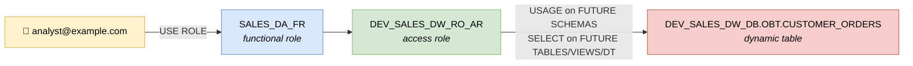

# Snowflake DCM Projects — Reference Demo

End-to-end Database Change Management example for Snowflake using **DCM Projects** (public preview), structured as the **hybrid platform + team pattern** with a full **AR / FR / SVC_FR** role layering. Manages databases, schemas, tables, views, dynamic tables, warehouses, roles, and grants declaratively from a single source of truth — the same scope as the sibling `../terraform/` setup, with multi-env support and CI/CD.

> **Status:** DCM Projects is in **public preview**. APIs and command syntax may shift before GA. Pin Snow CLI v3.16.0+.

The demo uses `proj_code: SALES` so it coexists with the existing `ENTECHLOG`-prefixed TF setup in the same Snowflake account — no ownership transfer needed. Swap `team_name` in `platform/dcm/manifest.yml` `teams:` list (and add a matching `teams/<name>/` directory) to model your own domains.

## Why DCM vs Terraform?

| Aspect | Terraform (`../terraform/`) | DCM Projects (this dir) |
|---|---|---|
| Language | HCL + Snowflake provider | SQL with Jinja2 templating |
| State | External tfstate file/backend | Tracked inside Snowflake (DCM project object) |
| Drift detection | Yes (refresh) | Yes (`PLAN` compares live to desired) |
| Object coverage | Whatever the provider supports | Native Snowflake — full coverage as DDL evolves |
| Run-time | Local + CI (TF binary + provider) | Local + CI (Snow CLI) — no provider lag |
| Plan output | `terraform plan` | `snow dcm plan` → `out/plan.json` |
| Cleanup | `terraform destroy` | `EXECUTE DCM PROJECT … PURGE` |
| Auditability | tfstate + git | DCM project history (SQL-queryable) + git |

DCM is recommended by Snowflake for net-new infrastructure.

## Architecture (hybrid pattern)

Two DCM projects per team — **platform** (foundation) + **team** (data) — each with its own deployer role. Platform owns the perimeter (DBs, roles, warehouses), team owns what's inside (schemas, tables, views).

```mermaid
flowchart TB
    subgraph PLATFORM["PLATFORM LAYER &nbsp;|&nbsp; deployer: SVC_PLATFORM_SNOW_DCM_ROLE"]
        PP["DCM_REGISTRY.PROJECTS.&#123;ENV&#125;_PLATFORM_PROJECT"]
        PP --> DBS["3 databases per team<br/>(RAW / PREP / DW shells)"]
        PP --> AR["6 Access Roles per env<br/>(RO + RW per DB)<br/><i>hold FUTURE grants</i>"]
        PP --> FR["4 Functional Roles per team<br/>(DE / DA / CORTEX / PIPE_ADMIN)<br/><i>no env, granted to humans</i>"]
        PP --> SVCFR["3 Service-FRs per env<br/>(DBT / KAFKA / SUPERSET)<br/><i>granted to service users</i>"]
        PP --> WHS["3 warehouses per env<br/>+ 1 shared query WH"]
        PP --> SCAFF["Team DCM deployer role<br/>+ DCM state schema<br/>+ AR-to-FR/SVC_FR grants<br/>+ OWNERSHIP transfers"]
    end

    subgraph TEAM["TEAM LAYER (per team) &nbsp;|&nbsp; deployer: SVC_&lt;TEAM&gt;_SNOW_DCM_ROLE"]
        TP["&#123;ENV&#125;_SALES_DW_DB.DCM.&#123;ENV&#125;_SALES_PROJECT"]
        TP --> SCHEMAS["Schemas inside the 3 DBs<br/>(RAW: SEED/YELLOW_TAXI/KAFKA/UTIL<br/>PREP: STAGING/INTERIM/UTIL<br/>DW: DIM/FACT/OBT/SEMANTIC/COMPLIANCE/UTIL)"]
        TP --> TVS["Tables, views, dynamic tables"]
        TP -.->|"NO grants &mdash; FUTURE grants on ARs auto-cover everything"| NOGRANT[" "]
    end

    PLATFORM ==>|"hands off DBs + DCM project<br/>via OWNERSHIP transfers"| TEAM

    classDef platform fill:#dae8fc,stroke:#6c8ebf,color:#000
    classDef team fill:#d5e8d4,stroke:#82b366,color:#000
    classDef hidden fill:none,stroke:none
    class PP,DBS,AR,FR,SVCFR,WHS,SCAFF platform
    class TP,SCHEMAS,TVS team
    class NOGRANT hidden
```



The role chain in action — analyst reads a table via FR → AR → FUTURE grant, with zero direct grants on the object:



## Layout

```
snow-infra/dcm/
├── README.md
├── config.toml.template                        # Snow CLI connections (platform + sales × 3 envs each)
│
├── platform/                                   # PLATFORM project
│   ├── bootstrap/                              # one-time, ACCOUNTADMIN
│   │   ├── 00_generate_platform_rsa_key.sh
│   │   ├── 01_create_platform_service_role.sql
│   │   ├── 02_create_platform_project_objects.sql
│   │   └── 99_teardown.sql
│   ├── dcm/
│   │   ├── manifest.yml                        # PLATFORM_DEV/STG/PRD targets, teams list
│   │   └── sources/
│   │       ├── macros/env_helpers.sql          # builders: db_name, ar_name, fr_name, svc_fr_name
│   │       └── definitions/
│   │           ├── access_roles.sql            # RO + RW AR per team-DB with FUTURE grants
│   │           ├── functional_roles.sql        # SALES_DE/DA/CORTEX/PIPE_ADMIN _FR + AR grants
│   │           ├── service_functional_roles.sql # {ENV}_SALES_DBT/KAFKA/SUPERSET_SVC_FR + AR grants
│   │           ├── team_databases.sql          # {ENV}_SALES_RAW/PREP/DW_DB (shells)
│   │           ├── team_warehouses.sql         # team WHs + USAGE to FR/SVC_FR + OWNERSHIP transfers
│   │           └── team_dcm_scaffolding.sql    # team DCM role + DCM state schema + ownership transfers
│   └── scripts/
│       ├── 01_plan.sh
│       ├── 02_deploy.sh
│       └── 04_purge.sql
│
└── teams/
    └── sales/                                  # SALES team project
        ├── bootstrap/00_generate_rsa_key.sh    # one-time team key
        ├── dcm/
        │   ├── manifest.yml                    # SALES_DEV/STG/PRD targets
        │   ├── sources/
        │   │   ├── macros/env_helpers.sql      # team-local: db_name, wh_name
        │   │   └── definitions/                # OBJECTS ONLY — no grants
        │   │       ├── raw_schemas.sql
        │   │       ├── prep_schemas.sql
        │   │       ├── dw_schemas.sql
        │   │       ├── raw_tables.sql
        │   │       ├── prep_views.sql
        │   │       └── dw_objects.sql
        │   └── post_scripts/01_seed_data.sql   # auto-run by official dcm-deploy action
        └── scripts/
            ├── 01_plan.sh
            ├── 02_deploy.sh
            └── 04_purge.sql
```

## Naming conventions

Env-first prefix preserved per repo standard (groups all DEV things together for Snowsight browsing). See `platform/dcm/sources/macros/env_helpers.sql` for the canonical builders.

| Object | Pattern | Example |
|---|---|---|
| Database | `{ENV}_{PROJ}_{LAYER}_DB` | `DEV_SALES_DW_DB` |
| Warehouse (per env) | `{ENV}_{PROJ}_{TOOL}_WH_{SIZE}` | `DEV_SALES_DBT_WH_XS` |
| Warehouse (shared) | `ALL_{PROJ}_{TOOL}_WH_{SIZE}` | `ALL_SALES_QUERY_WH_XS` |
| **Access Role** (per DB, env-scoped) | `{ENV}_{PROJ}_{LAYER}_{ACCESS}_AR` | `DEV_SALES_RAW_RO_AR`, `DEV_SALES_DW_RW_AR` |
| **Functional Role** (no env, per job) | `{PROJ}_{ROLE}_FR` | `SALES_DE_FR`, `SALES_DA_FR` |
| **Service-FR** (per env, per tool) | `{ENV}_{PROJ}_{TOOL}_SVC_FR` | `DEV_SALES_DBT_SVC_FR` |
| Team DCM deployer role | `SVC_{PROJ}_SNOW_DCM_ROLE` | `SVC_SALES_SNOW_DCM_ROLE` |
| Team DCM deployer user | `SVC_{PROJ}_SNOW_DCM_USER` | `SVC_SALES_SNOW_DCM_USER` |
| DCM project (platform) | `DCM_REGISTRY.PROJECTS.{ENV}_PLATFORM_PROJECT` | `DCM_REGISTRY.PROJECTS.DEV_PLATFORM_PROJECT` |
| DCM project (team) | `{ENV}_{PROJ}_DW_DB.DCM.{ENV}_{PROJ}_PROJECT` | `DEV_SALES_DW_DB.DCM.DEV_SALES_PROJECT` |

## Role architecture (AR / FR / SVC_FR)

The role layer separates *what privileges exist* (AR) from *who's the user* (FR / SVC_FR). Each layer changes for one reason: new DB → new ARs; new tool → new SVC_FR; new analyst → grant the FR. The flow diagram in [Architecture](#architecture-hybrid-pattern) shows the chain visually.

**Anti-patterns** (enforced by this demo's structure):
- Never grant an AR directly to a user — always go user → FR → AR
- Never grant FR to another FR — compose FRs from ARs only
- Never put `MANAGE GRANTS` on a team role — the platform role holds it and issues `FUTURE` grants on the ARs; team role just creates objects and FUTURE coverage applies

**Why FUTURE grants work without team-level MANAGE GRANTS:** the platform role (which legitimately has `MANAGE GRANTS`) creates the ARs and issues `GRANT … ON FUTURE TABLES IN DATABASE` while it still owns the DB. Ownership then transfers to the team. FUTURE grants survive ownership transfer, so any table the team creates afterwards inherits the AR's privileges automatically. The team role never touches grants — it just runs DDL.

## DBT layer chain

```
RAW_DB                  PREP_DB                  DW_DB
├── SEED        ───►    ├── STAGING     ───►    ├── DIM
├── YELLOW_TAXI         ├── INTERIM             ├── FACT
├── KAFKA               └── UTIL                ├── OBT       ◄── dynamic table
└── UTIL                                        ├── SEMANTIC  ◄── Cortex Analyst
                                                ├── COMPLIANCE
                                                ├── UTIL
                                                └── DCM       ◄── team DCM PROJECT object
```

## Prerequisites

- Snowflake account with **ACCOUNTADMIN access** (one-time bootstrap only)
- The `snow-tools` container from this repo:
  ```bash
  cd ../../snow-tools && docker-compose up -d --build
  ```
- `SNOWFLAKE_HOME` env var pointing at a persistent path (under the `/C` mount in this user's setup):
  ```bash
  export SNOWFLAKE_HOME=/C/Users/<your-user>/.snowflake
  ```

## Getting started

> All shell commands run inside `snow-tools`. Either `docker exec -it snow-tools bash` or wrap each with `docker exec snow-tools bash -lc '…'`.

### Step 1 — Platform bootstrap (Snowsight, ACCOUNTADMIN)

Paste `platform/bootstrap/01_create_platform_service_role.sql` into Snowsight as ACCOUNTADMIN. It creates:
- `SVC_PLATFORM_SNOW_DCM_ROLE` with the full account-level privilege set (CREATE DB/WH/ROLE/USER + MANAGE GRANTS + DATA_QUALITY app roles)
- `SVC_PLATFORM_SNOW_DCM_USER` (TYPE = SERVICE, key-pair only)
- `SVC_PLATFORM_SNOW_DCM_WH_XS`
- Prints your `ORG-ACCOUNT` identifier — save it

### Step 2 — Generate the platform RSA key (in snow-tools)

```bash
docker exec -it snow-tools bash -lc \
  'cd /C/.../snow-infra/dcm && \
   KEY_DIR=/C/Users/<you>/.snowflake/keys ./platform/bootstrap/00_generate_platform_rsa_key.sh'
```

Copy the printed `ALTER USER SVC_PLATFORM_SNOW_DCM_USER SET RSA_PUBLIC_KEY = '…'` into Snowsight and run.

### Step 3 — Create the platform DCM project objects

Either via Snowsight (paste `platform/bootstrap/02_create_platform_project_objects.sql`) or via snow CLI (after Step 5 config):
```bash
docker exec snow-tools bash -lc 'export SNOWFLAKE_HOME=/C/Users/<you>/.snowflake && \
    snow sql --connection dcm-platform-dev -f /C/.../snow-infra/dcm/platform/bootstrap/02_create_platform_project_objects.sql'
```

### Step 4 — Create the SALES team's DCM USER (one-time, ACCOUNTADMIN)

This is the team's headless deployer. The role for it (`SVC_SALES_SNOW_DCM_ROLE`) is created BY the platform DCM project in Step 6 — but the USER must exist beforehand because its RSA key needs to be registered out-of-band.

In Snowsight, as ACCOUNTADMIN:
```sql
USE ROLE SECURITYADMIN;
CREATE USER IF NOT EXISTS SVC_SALES_SNOW_DCM_USER
  TYPE              = SERVICE
  DEFAULT_WAREHOUSE = SVC_PLATFORM_SNOW_DCM_WH_XS
  COMMENT           = 'Service account for SALES team DCM plan/deploy';
```

### Step 5 — Generate the SALES team RSA key (in snow-tools)

```bash
docker exec -it snow-tools bash -lc \
  'cd /C/.../snow-infra/dcm && \
   KEY_DIR=/C/Users/<you>/.snowflake/keys ./teams/sales/bootstrap/00_generate_rsa_key.sh'
```

Paste the printed `ALTER USER SVC_SALES_SNOW_DCM_USER SET RSA_PUBLIC_KEY = '…'` into Snowsight and run.

### Step 6 — Wire up Snow CLI

Patch the `account_identifier` in BOTH manifest files (`platform/dcm/manifest.yml` and `teams/sales/dcm/manifest.yml`) with your real `ORG-ACCOUNT` value, then:

```bash
mkdir -p C:/Users/<you>/.snowflake
cp snow-infra/dcm/config.toml.template C:/Users/<you>/.snowflake/config.toml
# Edit the account value in all 6 connection blocks

docker exec snow-tools bash -lc 'export SNOWFLAKE_HOME=/C/Users/<you>/.snowflake && \
    snow connection test --connection dcm-platform-dev'
# Status: OK
```

### Step 7 — Platform plan + deploy

```bash
docker exec snow-tools bash -lc 'export SNOWFLAKE_HOME=/C/Users/<you>/.snowflake && \
    cd /C/.../snow-infra/dcm/platform/dcm && \
    snow dcm plan --target DCM_PLATFORM_DEV --connection dcm-platform-dev --save-output'
# Review out/plan.json, then:
docker exec snow-tools bash -lc 'export SNOWFLAKE_HOME=/C/Users/<you>/.snowflake && \
    cd /C/.../snow-infra/dcm/platform/dcm && \
    snow dcm deploy --target DCM_PLATFORM_DEV --connection dcm-platform-dev --alias "initial-platform"'
```

After deploy: 3 DBs, 6 ARs, 4 FRs, 3 SVC_FRs, 4 WHs, the SALES DCM role + DCM schema, all ownership transfers, the SALES user attachment.

### Step 8 — Create the SALES team DCM PROJECT object

DCM can't declare a DCM PROJECT inside another DCM project, so we create the team project once out-of-band (as the SALES DCM role, which platform just created and attached to your user):

```bash
docker exec snow-tools bash -lc 'export SNOWFLAKE_HOME=/C/Users/<you>/.snowflake && \
    snow sql --connection dcm-sales-dev -q "
    USE ROLE SVC_SALES_SNOW_DCM_ROLE;
    USE WAREHOUSE SVC_PLATFORM_SNOW_DCM_WH_XS;
    CREATE DCM PROJECT IF NOT EXISTS DEV_SALES_DW_DB.DCM.DEV_SALES_PROJECT
        COMMENT = '\''SALES team DCM project (DEV)'\'';
    "'
```

### Step 9 — SALES team plan + deploy

```bash
docker exec snow-tools bash -lc 'export SNOWFLAKE_HOME=/C/Users/<you>/.snowflake && \
    cd /C/.../snow-infra/dcm/teams/sales/dcm && \
    snow dcm plan --target DCM_SALES_DEV --connection dcm-sales-dev --save-output'

docker exec snow-tools bash -lc 'export SNOWFLAKE_HOME=/C/Users/<you>/.snowflake && \
    cd /C/.../snow-infra/dcm/teams/sales/dcm && \
    snow dcm deploy --target DCM_SALES_DEV --connection dcm-sales-dev --alias "initial-team"'
```

This creates 13 schemas + 4 tables + 2 views + 1 dynamic table. **No grants** — the platform's ARs (with their FUTURE grants) auto-cover everything.

### Step 10 — Seed data + verify

```bash
docker exec snow-tools bash -lc 'export SNOWFLAKE_HOME=/C/Users/<you>/.snowflake && \
    snow sql -f /C/.../snow-infra/dcm/teams/sales/dcm/post_scripts/01_seed_data.sql --connection dcm-sales-dev'
```

In Snowsight:
```sql
USE ROLE SALES_DA_FR;
USE WAREHOUSE ALL_SALES_QUERY_WH_XS;
SELECT * FROM DEV_SALES_DW_DB.OBT.CUSTOMER_ORDERS;
```

## Adding a new team

This is the test of whether the pattern actually scales. To onboard `MARKETING`:

1. **Platform manifest**: add `{ name: MARKETING }` to the `teams:` list in `platform/dcm/manifest.yml`
2. **Create the team's DCM USER** in Snowsight (ACCOUNTADMIN): `CREATE USER SVC_MARKETING_SNOW_DCM_USER TYPE=SERVICE …`
3. **Generate the team RSA key**: `SF_USER=SVC_MARKETING_SNOW_DCM_USER KEY_NAME=svc_marketing_dcm ./teams/sales/bootstrap/00_generate_rsa_key.sh` (or copy that script under `teams/marketing/bootstrap/`)
4. **Register the public key** in Snowsight (ACCOUNTADMIN)
5. **Platform deploy** — creates MARKETING DBs, ARs, FRs, SVC_FRs, warehouses, DCM scaffolding
6. **Create MARKETING DCM project** out-of-band (`CREATE DCM PROJECT DEV_MARKETING_DW_DB.DCM.DEV_MARKETING_PROJECT`)
7. **Copy** `teams/sales/` → `teams/marketing/`, swap `team_name: MARKETING` in manifest, push
8. **Team deploy** — creates schemas, tables, etc. inside the MARKETING DBs

The marketing team can now plan/deploy independently of SALES. Both teams' projects live in their own DBs; neither can see the other's plan history.

## Templating model

| Variable | Where | Drives |
|---|---|---|
| `proj_code` / `team_name` | platform manifest `teams:` list / team manifest defaults | Object name infix |
| `env_code` | per-target config | Env prefix on env-scoped objects |
| `deploy_account_user_roles` | true only in PLATFORM_DEV target | Account-level FRs + team DCM role created once |
| `data_retention_days` | per-target | Snowflake Time Travel retention |
| `*_wh_size`, `auto_suspend_seconds` | per-target | Per-env warehouse sizing |

DCM forbids `` / `` / `` — macros under `sources/macros/` are auto-loaded globally per project. Call by bare name.

## How DCM handles existing objects

DCM is fully declarative. First deploy → CREATEs. No code change → empty plan. Add a column → single ALTER. Manual drift → plan offers to reconcile.

## Migrating from Terraform (OWNERSHIP transfer)

This demo uses `proj_code: SALES` to coexist with the existing `ENTECHLOG` TF setup — no ownership transfer needed for the demo itself.

When you eventually want DCM to take over an environment TF currently owns:
1. Stand up DCM with a separate `proj_code` first (this demo) — proves the manifest + macros render and deploy cleanly
2. For real cutover: freeze TF changes on the target env, transfer ownership of every object to the DCM service role using `GRANT OWNERSHIP … COPY CURRENT GRANTS` (preserves downstream grants), then `snow dcm plan` should be empty
3. Record an empty deploy to baseline DCM as the new owner
4. Remove the corresponding resources from `../terraform/` and `terraform state rm` (do not destroy)

Rollback: reverse the OWNERSHIP grants back to the TF role. **Do not** `PURGE` migrated objects — DCM will drop them.

## CI/CD

`.github/workflows/dcm-deploy.yml` uses the official `Snowflake-Labs/snowflake_dcm_projects/actions/` actions:

| Trigger | Action | Target |
|---|---|---|
| PR touching `snow-infra/dcm/**` | `dcm-plan` — posts plan as PR comment | DEV |
| Push to `develop` | plan + deploy | DEV |
| Push to `main` | plan + deploy → STG, then PRD (gated by `snowflake-prd` GitHub environment) | STG → PRD |

Built-in safety:
- `allow-drops: "false"` — deploy fails if plan contains DROP
- `comment-on-pr: "true"` — plan diff visible inline
- `post-scripts-path: "post_scripts"` — `01_seed_data.sql` auto-runs after deploy
- `test-expectations: "true"` — runs DCM expectations, fails on regressions

Required GitHub secrets per environment: `SNOWFLAKE_PRIVATE_KEY`. Add separate secrets if running platform + team workflows under different service users.

**ADO migration:** see header comments in `dcm-deploy.yml` for the field-by-field mapping.

> **Note:** the workflow currently only wires the SALES team layer. Mirror the same job structure for the platform layer if you want CI to drive both.

## Cleanup

```bash
# Team layer first (drops schemas/tables/views inside team DBs)
snow sql -f teams/sales/scripts/04_purge.sql --connection dcm-sales-dev

# Then platform layer (drops DBs/roles/warehouses/scaffolding)
snow sql -f platform/scripts/04_purge.sql --connection dcm-platform-dev

# Finally, drop the platform DCM PROJECT objects + DCM_REGISTRY (Snowsight as ACCOUNTADMIN if needed)
```

For full teardown of the platform service identity itself, run `platform/bootstrap/99_teardown.sql` as ACCOUNTADMIN.

## References

- [DCM Projects overview](https://docs.snowflake.com/en/user-guide/dcm-projects/dcm-projects-overview)
- [DCM Projects files & templates](https://docs.snowflake.com/en/user-guide/dcm-projects/dcm-projects-files)
- [Snowflake-Labs/snowflake-dcm-projects](https://github.com/Snowflake-Labs/snowflake-dcm-projects) — canonical examples + GitHub Actions
- [Snowflake RBAC best practices (select.dev)](https://select.dev/posts/snowflake-rbac-best-practices) — AR/FR/SR pattern source
- [Snowflake object naming conventions (entechlog blog)](https://www.entechlog.com/blog/data/snowflake-object-naming-conventions/) — companion blog post
- Sibling Terraform setup: [`../terraform/`](../terraform/)
